[reference](https://otexts.com/fpp3/index.html)
> predicting the future as accurately as possible, given all of the information available, including historical data and knowledge of any future events that might impact the forecasts.

The predictability of an event or a quantity depends on several factors including:
- how well we understand the factors that contribute to it
- how much data is available
- how similar the future is to the past
- whether the forecasts can affect the thing we are trying to forecast.

**Short-term forecasts:** are needed for the scheduling of personnel, production and transportation. As part of the scheduling process, forecasts of demand are often also required.

**Medium-term forecasts:** are needed to determine future resource requirements, in order to purchase raw materials, hire personnel, or buy machinery and equipment.

**Long-term forecasts:** are used in strategic planning. Such decisions must take account of market opportunities, environmental factors and internal resources.

**USE CASES**
- Scheduling
- Strategic Planning

**_BASIC STEPS_**
1. **Problem Definition:** understanding of the way the forecasts will be used, who requires the forecasts, and how the forecasting function fits within the organisation requiring the forecasts.
2. **Gathering Information:** (a) statistical data, and (b) the accumulated expertise of the people who collect the data and use the forecasts.
3. **EDA:** Are there consistent patterns? Is there a significant trend? Is seasonality important? Is there evidence of the presence of business cycles? Are there any outliers in the data that need to be explained by those with expert knowledge? How strong are the relationships among the variables available for analysis?
4. **Choosing & Fitting Models:**  best model to use depends on the availability of historical data, the strength of relationships between the forecast variable and any explanatory variables, and the way in which the forecasts are to be used.
5. **Using & Evaluating a Forecasting Model:**

**_TIME SERIES PATTERNS_**
- **Trend:** A trend exists when there is a long-term increase or decrease in the data. It does not have to be linear.
- **Seasonal:** time series is affected by seasonal factors such as the time of the year or the day of the week. Seasonality is always of a fixed and known period.
- **Cyclic:** data exhibit rises and falls that are not of a fixed frequency. _These fluctuations are usually due to economic conditions, and are often related to the “business cycle.”_

# Judgmental Forecasting
- complete lack of historical data
- new product is being launched
- new competitor enters the market
- new and unique market conditions

_Three general settings in which judgmental forecasting is used:_
1. there are no available data, so that statistical methods are not applicable and judgmental forecasting is the only feasible approach
2. data are available, statistical forecasts are generated, and these are then adjusted using judgment
3. data are available and statistical and judgmental forecasts are generated independently and then combined.

**_KEY PRINCIPLES_**

**Set the forecasting task clearly and concisely**

**Implement a systematic approach**

**Document and justify**

**Systematically evaluate forecasts**

**Segregate forecasters and users**

**_Delphi Method_**
1. A panel of experts is assembled.
2. Forecasting tasks/challenges are set and distributed to the experts.
3. Experts return initial forecasts and justifications. These are compiled and summarised in order to provide feedback.
4. Feedback is provided to the experts, who now review their forecasts in light of the feedback. This step may be iterated until a satisfactory level of consensus is reached.
5. Final forecasts are constructed by aggregating the experts’ forecasts.

## Analogy Forecasting
## Scenario Forecasting
## New Product Forecasting

# Time Series Decomposition

**_Calendar Adjustments_**

**_Population Adjustments_**

**_Inflation Adjustments_**

**_Mathematical Transformations_**

## Time Series Components

**Additive Decomposition:** used if the magnitude of the seasonal fluctuations, or the variation around the trend-cycle, does not vary with the level of the time series.

**Multiplicative Decomposition:** used if the variation in the seasonal pattern, or the variation around the trend-cycle, appears to be proportional to the level of the time series.

**Moving Averages:**

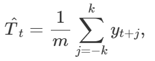

**X-11 Method:**

**Seasonal Extraction in ARIMA Time Series (SEATS) Method:**

**Seasonal and Trend decomposition using Loess (STL) Decomposition:**

_Advantages_
- Unlike SEATS and X-11, STL will handle any type of seasonality, not only monthly and quarterly data.
- The seasonal component is allowed to change over time, and the rate of change can be controlled by the user.
- The smoothness of the trend-cycle can also be controlled by the user.
- It can be robust to outliers (i.e., the user can specify a robust decomposition), so that occasional unusual observations will not affect the estimates of the trend-cycle and seasonal components. They will, however, affect the remainder component.

_Disadvantages_
- does not handle trading day or calendar variation automatically
- only provides facilities for additive decompositions

# Time Series Features

## Forecasting Methods

**Mean Method**

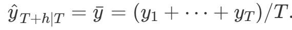

**Naive Method**

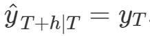

**Seasonal Naive Method**

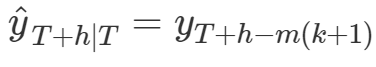

**Drift Method**

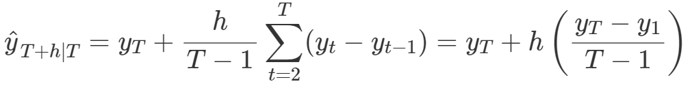

## Residual Diagnostics
> 1. Residuals are uncorrelated. If there are correlations between innovation residuals, then there is information left in the residuals which should be used in computing forecasts.
> 2. Residuals have zero mean. If they have a mean other than zero, then the forecasts are biased.

# Exponential Smoothing

## Simple Exponential Smoothing
> suitable for forecasting data with no clear trend or seasonal pattern

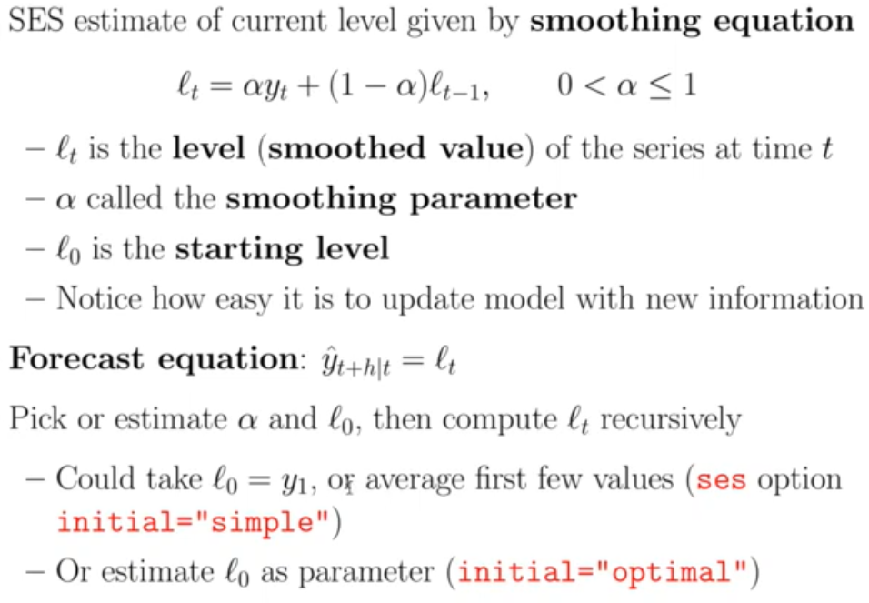

_Forecasts are calculated using weighted averages, where the weights decrease exponentially as observations come from further in the past — the smallest weights are associated with the oldest observations_
- If α is small (i.e., close to 0), more weight is given to observations from the more distant past.
- If α is large (i.e., close to 1), more weight is given to the more recent observations.
- For the extreme case where α = 1, yT+1|T=yT, and the forecasts are equal to the naïve forecasts.

**_OPTIMIZATION_**

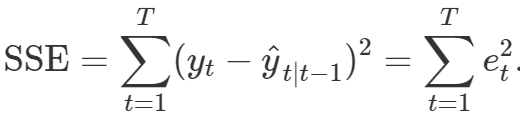

## Holts Linear Trend Model

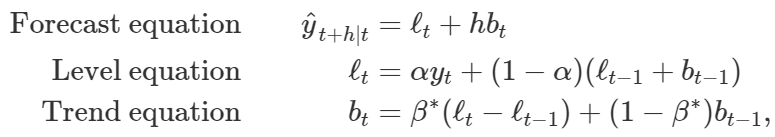

- **ℓ(t)** denotes an estimate of the level of the series at time t
- **b(t)** denotes an estimate of the trend (slope) of the series at time t
- **α** is the smoothing parameter for the level _0 ≤ α ≤ 1_.
- **β** is the smoothing parameter for the trend _0 ≤ β ≤ 1_
- smoothing parameters, α and β∗, and the initial values ℓ(0) and b(0) are estimated by minimising the SSE for the one-step training errors

### Damped Trend Methods
> The forecasts generated by Holt’s linear method display a constant trend (increasing or decreasing) indefinitely into the future. Empirical evidence indicates that these methods tend to over-forecast, especially for longer forecast horizons.

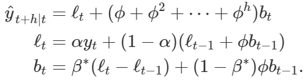

- If **ϕ** = 1, the method is identical to Holt’s linear method.
- For values between 0 and 1, **ϕ** dampens the trend so that it approaches a constant some time in the future.

## Holt-Winters

### Additive Method
> preferred when the seasonal variations are roughly constant through the series,

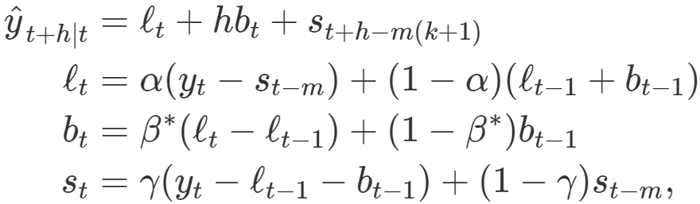

- **k** is the integer part of _(h − 1)/m_, which ensures that the estimates of the seasonal indices used for forecasting come from the final year of the sample.
- The level equation shows a weighted average between the seasonally adjusted observation _[y(t) − s(t) − m]_
- The non-seasonal forecast _[ℓ(t) − 1 + b(t) − 1]_ for time **t**
- The trend equation is identical to Holt’s linear method. The seasonal equation shows a weighted average between the current seasonal index, [y(t) − ℓ(t) − 1 − b(t) − 1], and the seasonal index of the same season last year _(i.e., m time periods ago)_.
### Multiplicative Method
> preferred when the seasonal variations are changing proportional to the level of the series

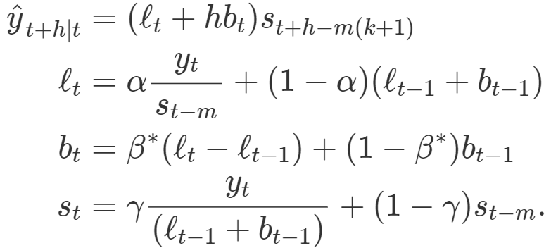

### Damped
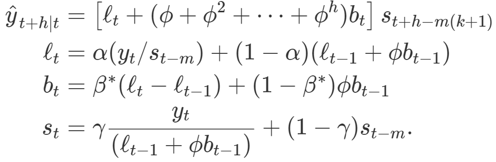

# ARIMA Models
