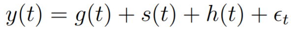

# Forecasting At Scale

## The Prophet Forecasting Model

- **g:** trend function which models non-periodic changes in the value of the
time series
- **s:** represents periodic changes (e.g., weekly and yearly seasonality),
- **h:** effects of holidays which occur on potentially irregular schedules over
one or more days
- **e:** idiosyncratic changes which are not
accommodated by the model

**_ADVATAGES_**
- **Flexibility:** We can easily accommodate seasonality with multiple periods and let the
analyst make different assumptions about trends
- Unlike with ARIMA models, the measurements do not need to be regularly spaced,
and we do not need to interpolate missing values e.g. from removing outliers.
- The forecasting model has easily interpretable parameters that can be changed by
the analyst to impose assumptions on the forecast. Moreover, analysts typically do
have experience with regression and are easily able to extend the model to include
new components

### #1 Trend model
### #2 Seasonality 
