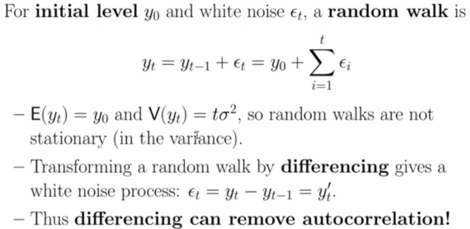
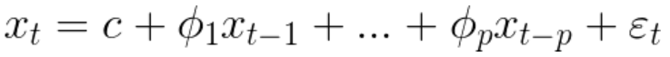
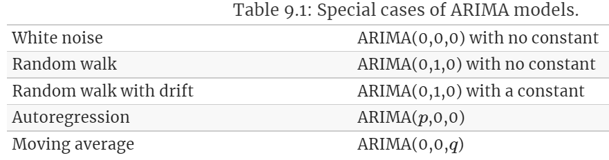

# Time Series

## Temporal Data
[reference](https://bookdown.org/rdpeng/timeseriesbook/)
## Frequency & Time Scale Analysis

## State Space Models

**state equation:** describes how the system evolves from one time point to the next.

**observation equation:** describes how the underlying state is transformed (with noise added) into something that we directly measure.

## Components

**TREND:** a long-term relatively smooth pattern that usually persists for more than one year.

**SEASONAL:** a pattern that appears in a regular interval wherein the frequency of occurrence is within a year or shorter.

**CYCLICAL:** a repeated pattern that appears in a time-series but beyond a frequency of one year

**RANDOM:** the component of a time-series that is obtained after these three patterns have been removed

**STATIONARITY:** statistical properties of the process do not change over time (i.e. distribution of the data does not depend on time). Statistical properties do not depend on the time at which the series is observed. _Thus, time series with trends, or with seasonality, are not stationary — the trend and seasonality will affect the value of the time series at different times. White Noise series is stationary — it does not matter when you observe it, it should look much the same at any point in time._
 A stationary time series will have no predictable patterns in the long-term. Time plots will show the series to be roughly horizontal (although some cyclic behaviour is possible), with constant variance.

- **_STORNG Stationarity:_** the distribution of a finite sub-sequence of random variables of the stochastic process remains the same as we shift it along the time index axis

- **_WEAK Stationarity:_** the process has the same mean at all time points, and that the covariance between the values at any two time points, t and t−k, depend only on lag, the difference between the two times, and not on the location of the points along the time axis.
- **_First Order Stationarity:_** a series that has means that never changes with time, but for which any other moment (like variance) can change.
- **_Trend Stationarity:_** underlying trend (function solely of time) can be removed, leaving a stationary process.

**DIFFERENCING:** The differences between consecutive observations.
- A series which is stationary after being differentiated once is said to be integrated of order 1. Therefore a series, which is stationary without being differentiated, is said to be order 0.
- Transformations such as logarithms can help to stabilize the variance of a time series.
- Differencing can help stabilize the mean of a time series by removing changes in the level of a time series, and therefore eliminating (or reducing) trend and seasonality.

**_Identifying non-stationary time series_**
- time plot of the data
- ACF plot
  + For a stationary time series, the ACF will drop to zero relatively quickly, while the ACF of non-stationary data decreases slowly.

**_Second Order Differencing:_** model changes in the changes

**_Seasonal Differencing:_** difference between an observation and the previous observation from the same season.

- If the seasonal difference model appear to be White Noise then

  

**_Unit Root Test:_** statistical hypothesis tests of stationarity that are designed for determining whether differencing is required.
- Kwiatkowski-Phillips-Schmidt-Shin (KPSS) test: null hypothesis is that the data are stationary, and we look for evidence that the null hypothesis is false. Small p-values (e.g., less than 0.05) suggest that differencing is required.

**AUTOCORRELATION:** refers to the way the observations in a time series are related to each other and is measured by a simple correlation between the current observation and the observation p periods from the current one

- _Regression errors are assumed to be uncorrelated. Accommodating autocorrelated errors makes time series analysis difficult and requires special models so that:_
  1. CIs are incorrect
  2. Take advantage when Forecasting

- **_Tests:_** Ljung-Box, Box-Pierce, Durbin-Watson
  + Null = the first h autocorrelations all equal 0 _(i.e no autocorrelations)_ versus the alternative that at least one is nonzero

**PARTIAL AUTOCORRELATION:** used to measure the degree of association between Yt and Yt-p when the effects at other time lags are removed

## Models: Baseline  

### WHITE NOISE
> variables are independent and identically distributed with a mean of zero. This means that all variables have the same variance and each value has a zero correlation with all other values in the series.

1. **_Predictability:_** If your time series is white noise, then, by definition, it is random. You cannot reasonably model it and make predictions.
2. **_Model Diagnostics:_** The series of errors from a time series forecast model should ideally be white noise.

_Not White Noise if:_
- Is the mean/level non-zero?
- Does the mean/level change over time?
- Does the variance change over time?
- Do values correlate with lag values?

### RANDOM WALK

Random walk models are widely used for non-stationary data, particularly financial and economic data. Random walks typically have:
- long periods of apparent trends up or down
- sudden and unpredictable changes in direction.

### SEASONAL NAIVE

## Models: Exponential Smoothing
### Simple Exponential Smoothing
> This method is suitable for forecasting data with no clear trend or seasonal pattern. Attach larger weights to more recent observations than to observations from the distant past. Forecasts are calculated using weighted averages, where the weights decrease exponentially as observations come from further in the past — the smallest weights are associated with the oldest observations

### Holt’s linear trend method

### Damped Trend Methods

### Holt-Winters

## Models: ARIMA
### AutoRegressive Model
> A time series modeled using an AR model is assumed to be generated as a linear function of its past values, plus a random noise/error

### Moving Average Model
> A time series modeled using a moving average model, denoted with MA(q), is assumed to be generated as a linear function of the last q+1 random shocks generated by εᵢ, a univariate white noise process:

### AutoRegressive Integrated Moving Average (ARMA) Model
> A time series modeled using an ARMA(p,q) model is assumed to be generated as a linear function of the last p values and the last q+1 random shocks generated by εᵢ, a univariate white noise process:

**_ARIMA(p,d,q)_**

**_ESTIMATION_**
Maximum Likelihood Estimation

**_AIC_**
useful for determining the order of an ARIMA model.

### Linear Regression

**Assumptions**
1. they have mean zero; otherwise the forecasts will be systematically biased.
2. they are not autocorrelated; otherwise the forecasts will be inefficient, as there is more information in the data that can be exploited.
3. they are unrelated to the predictor variables; otherwise there would be more information that should be included in the systematic part of the model.
4. the errors are normally distributed with a constant variance σ2 in order to easily produce prediction intervals.

## Evaluation

### Residual Diagnostics
A good forecasting method will yield innovation residuals with the following properties:
1. The innovation residuals are uncorrelated. If there are correlations between innovation residuals, then there is information left in the residuals which should be used in computing forecasts.
2. The innovation residuals have zero mean. If they have a mean other than zero, then the forecasts are biased.
3. The innovation residuals have constant variance. This is known as “homoscedasticity”.
4. The innovation residuals are normally distributed.

### Prediction Intervals
**One-Step**

**Multi-Step**
